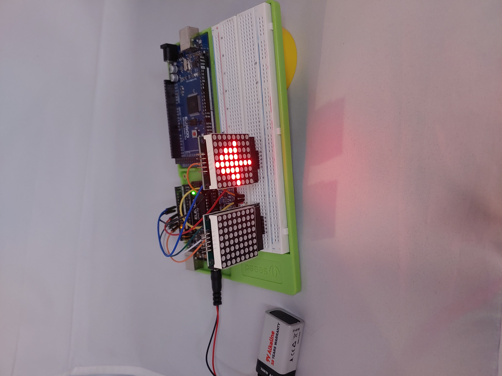
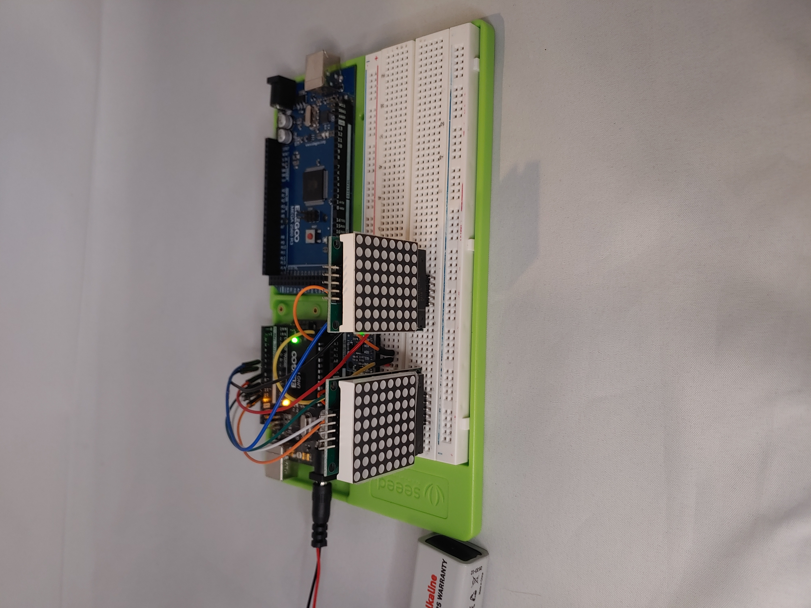
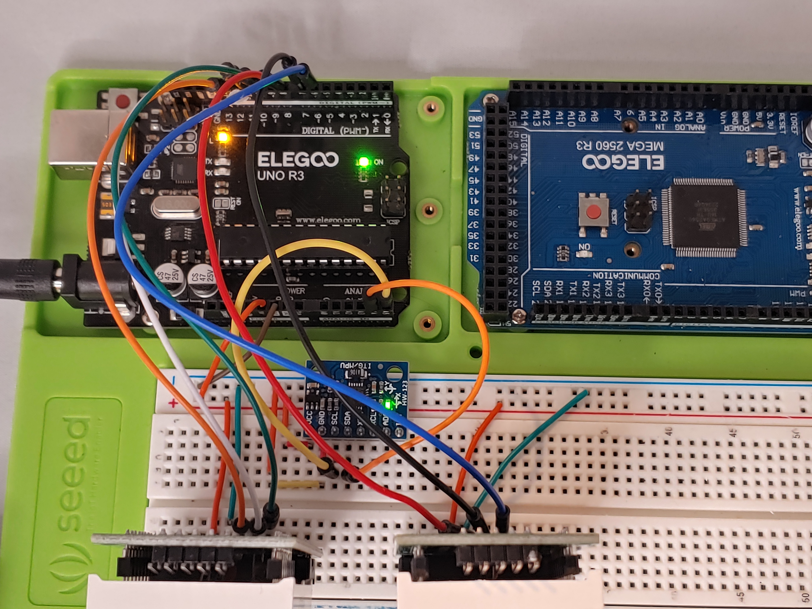
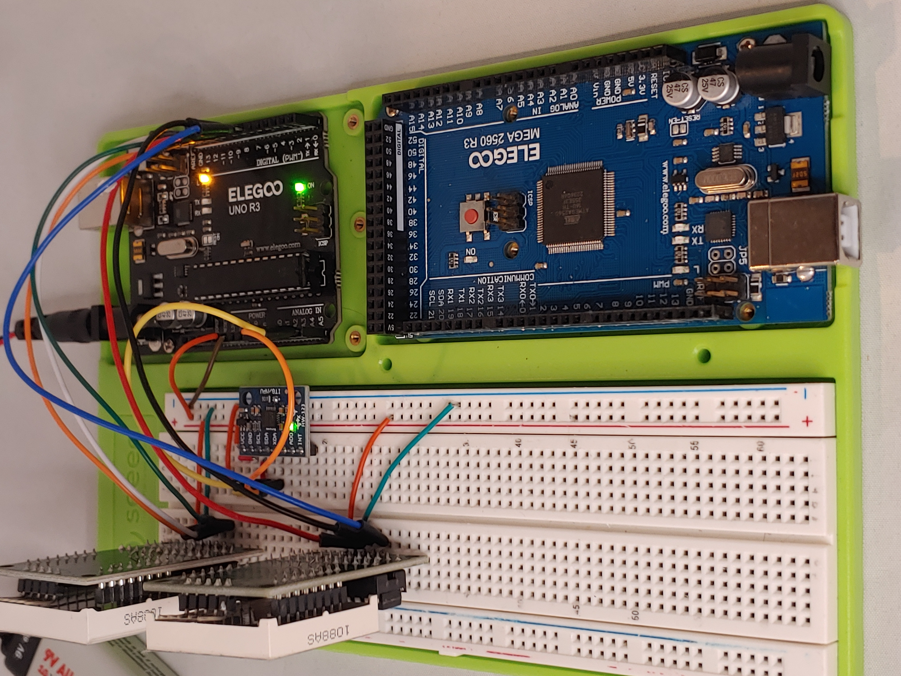
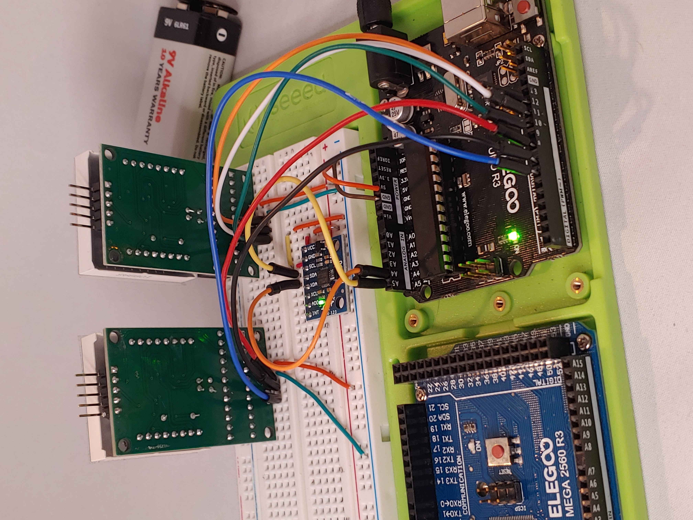

# E-Bike Security System

An advanced anti-theft system designed for electric bicycles. This project integrates GPS tracking, RFID/NFC locking, alarm systems, and onboard camera surveillance using Arduino and Raspberry Pi components.

## 🔒 Features

- **RFID/NFC Smart Lock:** Unlock via RFID card or smartphone NFC
- **GPS Tracking:** Real-time location updates if the bike is stolen
- **Motion-Triggered Alarm:** Sound and flashing lights when movement is detected
- **Cameras:** Hidden surveillance using Pi cameras
- **Remote Alerts:** Push notifications via SMS, Discord, or app
- **Power Management:** Separate battery with sleep and power-saving modes

## 🛠 Hardware

- Raspberry Pi 4 or 5
- Arduino Nano / Uno
- RFID Reader + Keycard / NFC-compatible phone
- GPS Module (Neo-6M or similar)
- Motion Sensor (PIR or accelerometer)
- Buzzer / Alarm
- LEDs or strobe lights
- Hidden Pi Cameras
- Separate rechargeable battery

## 💻 Software Stack

- Python (Raspberry Pi)
- C++ / Arduino Sketches (Microcontroller)
- Webhooks or Bluetooth for alerts
- Systemd or cron for background services

## 📦 Repository Structure

```
e-bike-security-system/
├── README.md
├── arduino/
│   └── rfid_lock.ino
├── pi/
│   ├── gps_tracker.py
│   ├── alarm_trigger.py
│   └── camera_stream.py
├── system/
│   └── systemd-setup.md
└── wiring/
    └── wiring_diagram.png
```

## 🚴 Use Case

This system is designed for stealth integration into e-bikes used in urban environments. It supports manual or remote arming, and all components are low-power to preserve battery life.

## 📷 Demo

_Add screenshots or photos of the build here._

## 🚨 Bike Alarm Alert System Demo

[](https://youtu.be/Zp6YWZ3aiaM?si=oYv9vBbMmv33CoZm)
This video demonstrates the real-time motion detection alert system using an Arduino tilt sensor, ESP32 receiver, and Discord webhook for instant notifications.


## 🚲 Turn Signal System – Photo Gallery

| Wiring Overview | LED Matrix Mount | Signal Controller |
|------------------|------------------|-------------------|
|  |  |  |

| Power Source | Rear LED View | Front LED View |
|--------------|----------------|----------------|
|  |  |  |


## 🧠 Author

Quantum Richardson  
[GitHub Profile](https://github.com/MadTech25)
